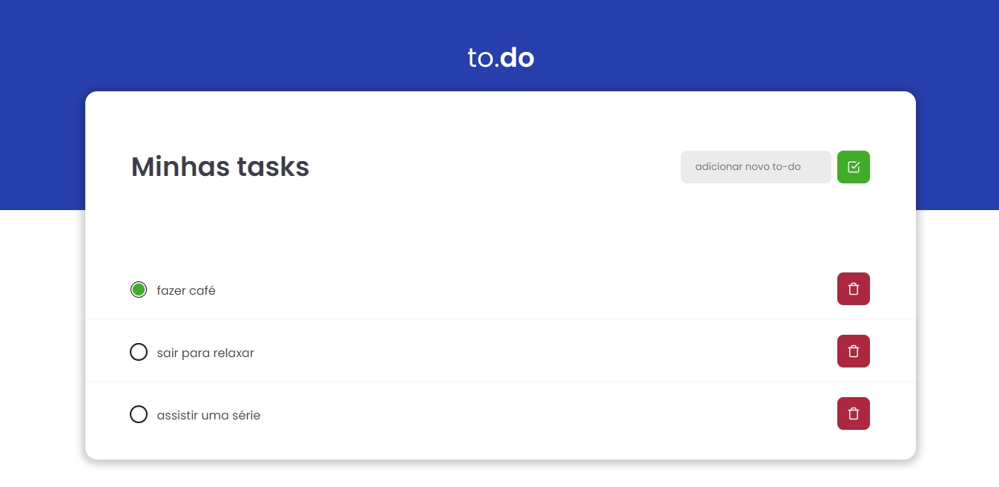
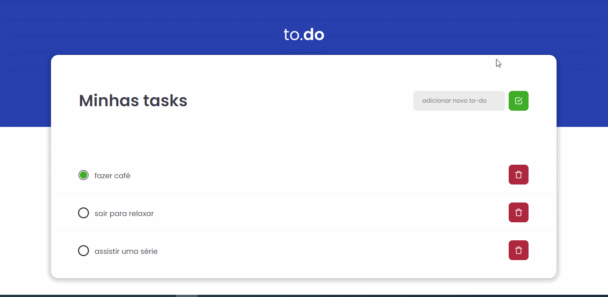
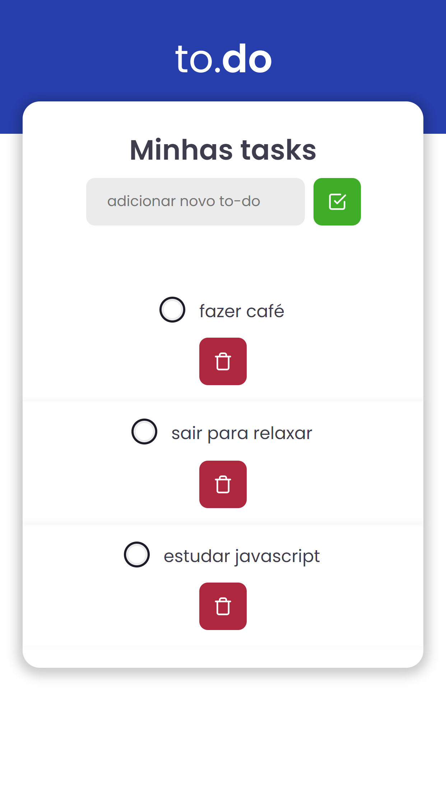

# To-do

Esse desafio, foi realizado para treinar o que aprendeu até agora no ReactJS

É uma pequena aplicação de atividades a fazer, para treinar um pouco mais sobre manipulação do estado no React.

- Adicionar uma nova tarefa
- Remover uma tarefa
- Marcar e desmarcar uma tarefa como concluída

## Tecnologias

- React
- Typescript
- Toastify

## Extras

- Notificação das ações
- Responsividade (mobile)

## Demo

## Mobile

